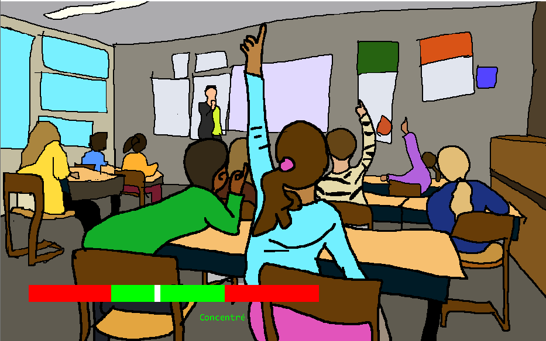

# Tadaaah

## Descriptions
Dans Tadaaah, vous incarnez un enfant et l'accompagnez au travers d'une journée banale de son quotidien. Vous expérimentez au travers de divers petits jeux ses difficultés quotidiennes et en découvrez l'origine. 

Le but de ce jeu est de sensibiliser au trouble déficit de l'attention avec ou sans hyperactivité. 

## Procédure d’installation / de lancement
Allez sur [itch](https://zowiich.itch.io/tadaaah) et cliquez sur "Run Tadaaah" ou téléchargez tous les fichiers du dépôt. Ensuite, il vous faut ouvrir le fichier "index.html" dans VS Code (ou utiliser un serveur local) et l'ouvrir via "go live" de l'extension "live server extension".

## Modules (loquace)(kaplay)

### Loquace
Pour toutes les parties de dialogue, j'ai utilisé le module [Loquace](https://github.com/loiccattani/kaplay-loquace/tree/main).

### Musique
Pour toutes les musiques du jeu [Retro-BGM-Chan](https://pixabay.com/users/retro-bgm-chan-55246343/).

### Code 

Je me suis basé sur le code d'un collègue, G. Caporizzo, pour réaliser ma barre de concentration dans la partie "école".

## Recours aux LLM 
J'ai utilisé les LLM (Claude, sonnet 4.6) dans les cas suivants :

### 1
Comprendre une partie de code qui m'avait été transmise pour mieux comprendre son fonctionnement afin de l'adapter à mon objectif. 

Prompt :
Salut Claude, on m'a passé ce bout de code, d'un autre étudiant qui a fait un système de barre. J'aimerais l'adapter à mon jeu, mais je ne comprends pas bien comment il fonctionne, peux-tu me le commenter avec des explications par étapes?

### 2
M'aidez à réaliser techniquement des processus que j'avais en tête, car il m'arrivait de savoir comment conceptuellement réaliser une idée, mais de ne pas avoir la syntaxe exacte.

Prompt : 
Salut Claude. Voici le script pour ma scène chez la psy. J'aimerais faire un quiz avec des boutons. L'objectif est que pour chaque symptôme (symp1 à 6) l'enfant doive valider la bonne réponse : "a" pour un symptôme de l'attention et "h" pour un de l'hyperactivité. J'ai créé une variable "correcte" avec à chaque fois associé les symptômes et la bonne réponse. J'aimerais faire une condition de réponse qui vérifie lorsque l'enfant clique sur une réponse si c'est la bonne ou non et fasse une réponse avec loquace différente.  Cependant, je ne sais pas comment aller chercher l’élément dans ma variable tableau.

### 3
Dans le sens inverse, lorsque j'avais une hypothèse sur une partie de mon code que je pensais pouvoir simplifier. Demander à un LLM si mon hypothèse est viable afin de ne pas perdre trop de temps à le tester moi-même.

Prompt (le code transmis avec):
"Ici dans ma const correcte, j'ai toute la partie question qui ne sert finalement à rien. Est-ce que je peux simplifier cette variable et par la même simplifier les comparaisons avec la variable bonne réponse et mes condisions if?"

## Contexte
 Ce projet a été développé dans le cadre du cours <Développement de jeux vidéo 2D > dispensé par Loïc Cattani (SLI, Lettres, UNIL).